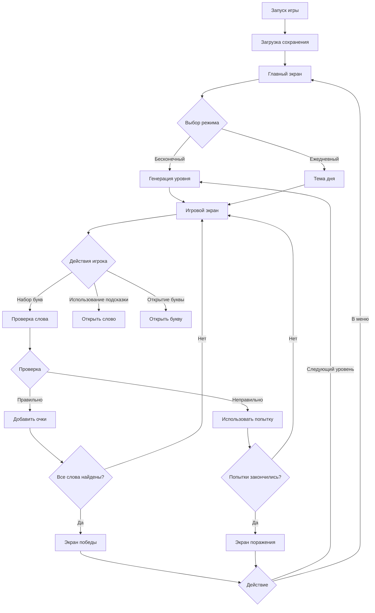

# Урок 1: Планирование и базовая структура игры "Word Wonders"

## 📋 Что мы будем создавать

Добро пожаловать в создание вашей первой мобильной игры! **Word Wonders** — это игра, где игрок должен находить слова из букв, расположенных по кругу. 

**Представьте себе:** у вас есть 10 букв, расположенных по кругу на экране, и несколько загаданных слов. Ваша задача — составлять эти слова из доступных букв!

## 🎯 Цель первого урока
На этом уроке мы создадим **базовую структуру проекта** и **главный экран игры**. Это фундамент, на котором мы будем строить всю игру.

---

## 📁 Шаг 1: Создание структуры проекта

**Внимание!** Перед тем как писать код, нужно организовать файлы и папки. Это как строительство дома — сначала делаем план, потом строим.

### 1.1 Создаем папку для проекта
На вашем компьютере создайте новую папку с именем `word-wonders`.

### 1.2 Внутри создаем структуру файлов
Откройте папку `word-wonders` и создайте следующие папки и файлы:

```
word-wonders/
├── index.html          # Основной HTML файл - "лицо" игры
├── css/                # Папка для стилей (внешний вид)
│   ├── main.css        # Основные стили
│   ├── screens.css     # Стили для экранов игры
│   └── components.css  # Стили для компонентов (кнопки, карточки)
├── js/                 # Папка для JavaScript (логика игры)
│   ├── game.js         # Главная логика игры
│   ├── game-state.js   # Состояние игры (уровень, очки)
│   ├── level-generator.js # Генератор уровней
│   ├── ui-manager.js   # Управление интерфейсом
│   ├── screen-manager.js # Переключение экранов
│   ├── event-handlers.js # Обработчики нажатий кнопок
│   ├── storage-manager.js # Сохранение прогресса
│   └── utils.js        # Вспомогательные функции
└── data/               # Папка для данных игры
    └── word-list.js    # Список слов для игры
```

**Почему именно так?**
- **index.html** — это "входная дверь" в нашу игру. Браузер открывает этот файл первым.
- **css/** — здесь мы храним все стили (цвета, размеры, расположение элементов).
- **js/** — здесь "мозг" игры, вся логика.
- **data/** — здесь храним данные (списки слов).

**Разделение на файлы** помогает:
- Находить ошибки быстрее
- Переиспользовать код
- Работать в команде (каждый может работать над своим файлом)

---

## 🧠 Шаг 2: Понимание архитектуры игры (блок-схема)

Прежде чем писать код, давайте поймем КАК будет работать наша игра. Посмотрите на эту схему:



**Объяснение схемы:**
1. Игра загружается и показывает **главный экран** (меню)
2. Игрок выбирает режим: **бесконечный** или **слово дня**
3. Переходим на **игровой экран** с буквами по кругу
4. Игрок может:
   - Набирать буквы для составления слова
   - Использовать подсказки
   - Открывать буквы
5. Проверяем слово — если правильно, добавляем очки
6. Если нашли все слова — победа! Если попытки кончились — поражение
7. После результата можно: идти дальше или вернуться в меню

---

## 🏗️ Шаг 3: Создание HTML-структуры (index.html)

Теперь создадим основной HTML файл. Откройте файл `index.html` в редакторе кода (VS Code, Notepad++, Sublime Text) и добавьте:

### 3.1 Базовый HTML-каркас
```html
<!DOCTYPE html>
<!-- Эта строка говорит браузеру, что это HTML5 документ -->
<html lang="ru">
<!-- lang="ru" указывает, что язык контента - русский -->
<head>
    <!-- В <head> мы помещаем мета-информацию, стили, заголовок -->
    
    <meta charset="UTF-8">
    <!-- Указываем кодировку UTF-8 для поддержки русских букв -->
    
    <meta name="viewport" content="width=device-width, initial-scale=1.0, maximum-scale=1.0, user-scalable=no">
    <!-- 
    Это ВАЖНО для мобильных устройств:
    width=device-width - ширина экрана равна ширине устройства
    initial-scale=1.0 - начальный масштаб 100%
    maximum-scale=1.0 - запрещаем увеличивать масштаб
    user-scalable=no - запрещаем пользователю масштабировать
    -->
    
    <title>Word Wonders</title>
    <!-- Заголовок игры (виден во вкладке браузера) -->
    
    <link rel="stylesheet" href="https://cdnjs.cloudflare.com/ajax/libs/font-awesome/6.4.0/css/all.min.css">
    <!-- Подключаем библиотеку Font Awesome для иконок (стрелочки, кнопки) -->
    
    <!-- Подключаем наши собственные CSS файлы -->
    <link rel="stylesheet" href="css/main.css">
    <link rel="stylesheet" href="css/screens.css">
    <link rel="stylesheet" href="css/components.css">
</head>
<body>
    <!-- В <body> помещаем всё, что видит пользователь -->
    
    <!-- TODO: Здесь будут экраны игры -->
    
    <!-- Подключаем JavaScript файлы в правильном порядке -->
    <!-- Порядок ВАЖЕН, потому что одни файлы зависят от других -->
    <script src="data/word-list.js"></script>
    <script src="js/utils.js"></script>
    <script src="js/storage-manager.js"></script>
    <script src="js/level-generator.js"></script>
    <script src="js/game-state.js"></script>
    <script src="js/ui-manager.js"></script>
    <script src="js/screen-manager.js"></script>
    <script src="js/event-handlers.js"></script>
    <script src="js/game.js"></script>
</body>
</html>
```

### 3.2 Добавляем систему экранов
Теперь добавим сами экраны внутрь тега `<body>`:

```html
<body>
    <!-- Главный экран (меню) -->
    <div id="mainScreen" class="screen active">
        <!-- Этот экран будет виден при запуске игры -->
        <!-- Заполним его содержимым позже -->
    </div>
    
    <!-- Игровой экран (круг с буквами) -->
    <div id="gameScreen" class="screen">
        <!-- Здесь будет основная игра -->
        <!-- Пока оставляем пустым -->
    </div>
    
    <!-- Экран результатов (победа/поражение) -->
    <div id="resultScreen" class="screen">
        <!-- Здесь покажем результат игры -->
    </div>
    
    <!-- Оверлей для сообщений (всплывающие окна) -->
    <div id="messageOverlay" class="message-overlay">
        <!-- Это всплывающее окно для сообщений типа "Правильно!" -->
        <div class="message-box">
            <div id="messageIcon" class="message-icon">✨</div>
            <div id="messageText" class="message-text">Сообщение</div>
            <button id="messageOk" class="message-btn">OK</button>
        </div>
    </div>
    
    <!-- Подключаем JavaScript файлы -->
    <script src="data/word-list.js"></script>
    <!-- ... остальные скрипты ... -->
</body>
```

**Объяснение системы экранов:**
- У нас 4 экрана: `mainScreen`, `gameScreen`, `resultScreen`, `messageOverlay`
- Класс `screen` будет скрывать все экраны
- Класс `active` будет показывать текущий активный экран
- В каждый момент времени активен только один экран
- `messageOverlay` — это всплывающее окно поверх других экранов

---

## 🎨 Шаг 4: Создание базовых стилей

### 4.1 Основные стили (main.css)
Откройте файл `css/main.css` и добавьте:

```css
/* 
  СБРОС СТИЛЕЙ
  Каждый браузер имеет свои "дефолтные" стили.
  Мы сбрасываем их, чтобы наша игра выглядела одинаково везде.
*/
* {
    margin: 0;          /* Убираем внешние отступы */
    padding: 0;         /* Убираем внутренние отступы */
    box-sizing: border-box; /* Важная настройка! */
    
    /*
      box-sizing: border-box означает:
      width = padding + border + content
      Без этого padding добавляется к ширине элемента
    */
    
    -webkit-tap-highlight-color: transparent;
    /* Убирает синий фон при нажатии на элементы на мобильных */
}

/* 
  СТИЛИ ДЛЯ ТЕЛА ДОКУМЕНТА
  body - это фон всей нашей страницы
*/
body {
    /* Используем современные системные шрифты */
    font-family: -apple-system, BlinkMacSystemFont, 'Segoe UI', Roboto, sans-serif;
    
    /* 
      Градиентный фон от темно-синего к темно-серому
      linear-gradient создает плавный переход между цветами
      135deg - угол градиента (диагональ)
    */
    background: linear-gradient(135deg, #0f172a 0%, #1e293b 100%);
    
    color: #f8fafc;     /* Цвет текста - светло-серый */
    height: 100vh;      /* Высота 100% от высоты окна браузера */
    overflow: hidden;   /* Скрываем скроллбар */
    
    touch-action: manipulation;
    /* Оптимизация для touch-устройств */
}

/* 
  АНИМАЦИИ
  Анимации делают интерфейс "живым"
*/
@keyframes popIn {
    /* Анимация появления элемента (как всплывает) */
    0% { 
        transform: scale(0.5); /* Начальный размер 50% */
        opacity: 0;            /* Полностью прозрачный */
    }
    100% { 
        transform: scale(1);   /* Конечный размер 100% */
        opacity: 1;            /* Полностью непрозрачный */
    }
}

@keyframes fadeIn {
    /* Анимация плавного появления */
    from { opacity: 0; }
    to { opacity: 1; }
}
```

### 4.2 Стили для экранов (screens.css)
Откройте файл `css/screens.css`:

```css
/* 
  ОБЩИЕ СТИЛИ ЭКРАНОВ
  Все экраны имеют одинаковое базовое поведение
*/
.screen {
    display: none;          /* По умолчанию все экраны скрыты */
    height: 100vh;          /* Высота во весь экран */
    width: 100vw;           /* Ширина во весь экран */
    position: fixed;        /* Фиксированное позиционирование */
    top: 0;                 /* Прижимаем к верхнему краю */
    left: 0;                /* Прижимаем к левому краю */
    flex-direction: column; /* Располагаем элементы в колонку */
}

/* 
  АКТИВНЫЙ ЭКРАН
  Когда добавляем класс .active - экран становится видимым
*/
.screen.active {
    display: flex;          /* Используем flexbox для раскладки */
}

/* 
  ГЛАВНЫЙ ЭКРАН (МЕНЮ)
*/
#mainScreen {
    /* Центрируем содержимое по вертикали и горизонтали */
    justify-content: center; /* Центр по вертикали */
    align-items: center;     /* Центр по горизонтали */
    
    gap: 20px;              /* Расстояние между элементами */
    padding: 16px;          /* Отступы от краев экрана */
}

/* 
  ИГРОВОЙ ЭКРАН
*/
#gameScreen {
    padding: 8px;           /* Меньшие отступы для игрового экрана */
    gap: 6px;               /* Меньшее расстояние между элементами */
}

/* 
  ЭКРАН РЕЗУЛЬТАТОВ
*/
#resultScreen {
    justify-content: center;
    align-items: center;
    gap: 16px;
    text-align: center;     /* Выравниваем текст по центру */
    padding: 16px;
}

/* 
  ОВЕРЛЕЙ ДЛЯ СООБЩЕНИЙ
  Это всплывающее окно поверх других экранов
*/
.message-overlay {
    position: fixed;
    top: 0;
    left: 0;
    width: 100%;
    height: 100%;
    background: rgba(0, 0, 0, 0.7); /* Полупрозрачный черный фон */
    display: none;                   /* По умолчанию скрыт */
    align-items: center;
    justify-content: center;
    z-index: 1000;                  /* Поверх всех элементов */
    padding: 16px;                  /* Отступы от краев */
}

.message-overlay.active {
    display: flex;                  /* Показываем при добавлении .active */
    animation: fadeIn 0.3s;         /* Плавное появление */
}

/* 
  КОНТЕЙНЕР СООБЩЕНИЯ
*/
.message-box {
    background: #1e293b;            /* Темный фон как у body */
    border-radius: 12px;            /* Скругленные углы */
    padding: 18px;                  /* Внутренние отступы */
    max-width: 260px;               /* Максимальная ширина */
    width: 100%;                    /* Занимает всю доступную ширину */
    text-align: center;
    border: 1px solid rgba(255, 255, 255, 0.1); /* Тонкая белая рамка */
    box-shadow: 0 8px 24px rgba(0, 0, 0, 0.3);  /* Тень для объема */
}

.message-icon {
    font-size: 1.6rem;             /* Крупная иконка */
    margin-bottom: 10px;           /* Отступ снизу */
}

.message-text {
    font-size: 0.9rem;             /* Размер текста сообщения */
    margin-bottom: 14px;           /* Отступ перед кнопкой */
    line-height: 1.4;              /* Межстрочный интервал */
}

.message-btn {
    background: linear-gradient(135deg, #3b82f6, #1d4ed8); /* Синий градиент */
    color: white;                   /* Белый текст */
    border: none;                   /* Без рамки */
    border-radius: 8px;             /* Скругленные углы */
    padding: 10px;                  /* Отступы внутри кнопки */
    font-size: 0.9rem;              /* Размер текста */
    font-weight: 600;               /* Жирный текст */
    cursor: pointer;                /* Курсор-указатель при наведении */
    width: 100%;                    /* На всю ширину контейнера */
}
```

---

## ✨ Шаг 5: Создаем главный экран (меню)

### 5.1 Обновляем HTML главного экрана
Вернитесь к файлу `index.html` и обновите блок `#mainScreen`:

```html
<!-- Главный экран -->
<div id="mainScreen" class="screen active">
    <!-- ЛОГОТИП ИГРЫ -->
    <div class="logo">
        <h1>WORD WONDERS</h1>
        <p>Собирай слова из букв</p>
    </div>
    
    <!-- КНОПКИ ВЫБОРА РЕЖИМА -->
    <div class="mode-buttons">
        <!-- Кнопка "Бесконечная игра" -->
        <button id="infiniteMode" class="mode-btn infinite">
            <div class="mode-content">
                <div class="mode-icon">
                    <!-- Иконка бесконечности из Font Awesome -->
                    <i class="fas fa-infinity"></i>
                </div>
                <div class="mode-text">
                    <h3>Бесконечная игра</h3>
                    <p>Уровни со сложностью</p>
                </div>
            </div>
            <!-- Стрелочка справа -->
            <i class="fas fa-chevron-right"></i>
        </button>
        
        <!-- Кнопка "Слово дня" -->
        <button id="dailyMode" class="mode-btn daily">
            <div class="mode-content">
                <div class="mode-icon">
                    <!-- Иконка календаря -->
                    <i class="fas fa-calendar-day"></i>
                </div>
                <div class="mode-text">
                    <h3>Слово дня</h3>
                    <p>Новая тема каждый день</p>
                </div>
            </div>
            <!-- Статус (Доступно/Пройдено) -->
            <div id="dailyStatus" class="mode-status status-available">Доступно</div>
        </button>
    </div>
    
    <!-- ПАНЕЛЬ СТАТИСТИКИ -->
    <div class="stats-bar">
        <!-- Уровень -->
        <div class="stat-item">
            <div class="stat-icon" style="background: rgba(59, 130, 246, 0.2);">
                <i class="fas fa-trophy" style="color: #60a5fa;"></i>
            </div>
            <div class="stat-value" id="mainLevel">1</div>
            <div class="stat-label">Уровень</div>
        </div>
        
        <!-- Подсказки -->
        <div class="stat-item">
            <div class="stat-icon" style="background: rgba(245, 158, 11, 0.2);">
                <i class="fas fa-lightbulb" style="color: #f59e0b;"></i>
            </div>
            <div class="stat-value" id="mainHints">3</div>
            <div class="stat-label">Подсказки</div>
        </div>
        
        <!-- Попытки -->
        <div class="stat-item">
            <div class="stat-icon" style="background: rgba(34, 197, 94, 0.2);">
                <i class="fas fa-eye" style="color: #4ade80;"></i>
            </div>
            <div class="stat-value" id="mainAttempts">5</div>
            <div class="stat-label">Попытки</div>
        </div>
    </div>
</div>
```

### 5.2 Добавляем стили для компонентов (components.css)
Создайте файл `css/components.css` и добавьте:

```css
/* 
  ЛОГОТИП ИГРЫ
*/
.logo {
    text-align: center;      /* Выравниваем текст по центру */
    margin-bottom: 8px;      /* Отступ снизу */
}

.logo h1 {
    font-size: 1.7rem;       /* Размер шрифта заголовка */
    font-weight: 800;        /* Очень жирный шрифт */
    
    /* 
      ГРАДИЕНТ ДЛЯ ТЕКСТА
      Это крутой эффект - текст с градиентом!
      -webkit-background-clip: text - обрезаем фон по форме текста
      color: transparent - делаем текст прозрачным, чтобы виден был фон
    */
    background: linear-gradient(45deg, #60a5fa, #a78bfa);
    -webkit-background-clip: text;
    background-clip: text;
    color: transparent;
    
    margin-bottom: 4px;      /* Отступ снизу */
}

.logo p {
    font-size: 0.8rem;       /* Меньший шрифт для подзаголовка */
    color: #94a3b8;          /* Светло-серый цвет */
}

/* 
  КОНТЕЙНЕР ДЛЯ КНОПОК РЕЖИМОВ
*/
.mode-buttons {
    display: flex;                   /* Используем flexbox */
    flex-direction: column;          /* Элементы в колонку */
    gap: 10px;                       /* Расстояние между кнопками */
    width: 100%;                     /* На всю ширину */
    max-width: 240px;                /* Но не больше 240px */
}

/* 
  КНОПКА РЕЖИМА
*/
.mode-btn {
    background: rgba(255, 255, 255, 0.08); /* Полупрозрачный белый фон */
    border: 1px solid rgba(255, 255, 255, 0.1); /* Тонкая белая рамка */
    border-radius: 12px;             /* Скругленные углы */
    padding: 14px;                   /* Внутренние отступы */
    color: #f8fafc;                  /* Цвет текста */
    font-size: 0.95rem;              /* Размер шрифта */
    font-weight: 600;                /* Жирный шрифт */
    cursor: pointer;                 /* Курсор-указатель */
    
    /* Плавный переход при изменении свойств */
    transition: all 0.2s;
    
    /* Располагаем содержимое кнопки */
    display: flex;
    align-items: center;             /* Вертикальное выравнивание */
    justify-content: space-between;  /* Элементы по краям */
}

/* 
  ЭФФЕКТ ПРИ НАЖАТИИ НА КНОПКУ
*/
.mode-btn:active {
    transform: scale(0.98);          /* Немного уменьшаем */
    background: rgba(255, 255, 255, 0.12); /* Делаем фон светлее */
}

/* 
  ОТКЛЮЧЕННАЯ КНОПКА
  (например, если "Слово дня" уже пройдено)
*/
.mode-btn:disabled {
    opacity: 0.5;                    /* Полупрозрачная */
    cursor: not-allowed;             /* Курсор "нельзя" */
}

.mode-btn:disabled:active {
    transform: none;                 /* Отключаем анимацию нажатия */
}

/* 
  КОНТЕЙНЕР СОДЕРЖИМОГО КНОПКИ
*/
.mode-content {
    display: flex;
    align-items: center;
    gap: 8px;                        /* Расстояние между иконкой и текстом */
}

/* 
  ИКОНКА В КНОПКЕ
*/
.mode-icon {
    width: 30px;                     /* Фиксированная ширина */
    height: 30px;                    /* Фиксированная высота */
    border-radius: 7px;              /* Скругленные углы */
    display: flex;
    align-items: center;
    justify-content: center;
    font-size: 0.9rem;               /* Размер иконки */
}

/* 
  ЦВЕТ ИКОНКИ ДЛЯ "БЕСКОНЕЧНОЙ ИГРЫ"
*/
.infinite .mode-icon {
    background: linear-gradient(135deg, #3b82f6, #1d4ed8); /* Синий градиент */
}

/* 
  ЦВЕТ ИКОНКИ ДЛЯ "СЛОВА ДНЯ"
*/
.daily .mode-icon {
    background: linear-gradient(135deg, #10b981, #059669); /* Зеленый градиент */
}

/* 
  ТЕКСТ В КНОПКЕ
*/
.mode-text h3 {
    font-size: 0.9rem;
    margin-bottom: 2px;              /* Маленький отступ снизу */
}

.mode-text p {
    font-size: 0.7rem;               /* Мелкий текст */
    color: #94a3b8;                  /* Серый цвет */
}

/* 
  СТАТУС КНОПКИ (Доступно/Пройдено)
*/
.mode-status {
    font-size: 0.65rem;              /* Очень мелкий текст */
    padding: 3px 6px;                /* Маленькие отступы */
    border-radius: 8px;              /* Скругленные углы */
    font-weight: 500;                /* Средняя жирность */
}

/* 
  СТАТУС "ДОСТУПНО" (зеленый)
*/
.status-available {
    background: rgba(34, 197, 94, 0.2); /* Полупрозрачный зеленый */
    color: #4ade80;                  /* Ярко-зеленый текст */
}

/* 
  СТАТУС "ПРОЙДЕНО" (серый)
*/
.status-completed {
    background: rgba(148, 163, 184, 0.2); /* Полупрозрачный серый */
    color: #94a3b8;                  /* Серый текст */
}

/* 
  ПАНЕЛЬ СТАТИСТИКИ
*/
.stats-bar {
    display: flex;
    justify-content: space-around;   /* Равномерно распределяем элементы */
    width: 100%;
    max-width: 240px;                /* Такая же ширина как у кнопок */
    background: rgba(255, 255, 255, 0.05); /* Очень прозрачный белый */
    border-radius: 12px;             /* Скругленные углы */
    padding: 12px;                   /* Внутренние отступы */
    margin-top: 6px;                 /* Отступ сверху от кнопок */
}

/* 
  ОДИН ЭЛЕМЕНТ СТАТИСТИКИ
*/
.stat-item {
    display: flex;
    flex-direction: column;          /* Иконка над цифрой */
    align-items: center;             /* Центрируем по горизонтали */
    gap: 3px;                        /* Маленькое расстояние */
}

/* 
  ИКОНКА СТАТИСТИКИ
*/
.stat-icon {
    width: 22px;                     /* Маленькая иконка */
    height: 22px;
    border-radius: 5px;              /* Скругленные углы */
    display: flex;
    align-items: center;
    justify-content: center;
    font-size: 0.75rem;              /* Маленький размер иконки */
}

/* 
  ЗНАЧЕНИЕ СТАТИСТИКИ (цифра)
*/
.stat-value {
    font-size: 0.85rem;              /* Размер цифры */
    font-weight: 700;                /* Жирная цифра */
}

/* 
  ПОДПИСЬ СТАТИСТИКИ (текст под цифрой)
*/
.stat-label {
    font-size: 0.6rem;               /* Очень мелкий текст */
    color: #94a3b8;                  /* Серый цвет */
}
```

---

## 🧪 Шаг 6: Тестируем наш прогресс

### 6.1 Создаем временный JavaScript для тестирования
Создайте файл `js/game.js` и добавьте:

```javascript
// ВРЕМЕННЫЙ КОД ДЛЯ ТЕСТИРОВАНИЯ
console.log('🎮 Игра Word Wonders загружена!');

// Простая функция для переключения экранов
function showScreen(screenId) {
    console.log('🔄 Переключаем экран на:', screenId);
    
    // 1. Скрываем ВСЕ экраны
    // querySelectorAll находит все элементы с классом .screen
    document.querySelectorAll('.screen').forEach(screen => {
        screen.classList.remove('active'); // Убираем класс .active
    });
    
    // 2. Показываем НУЖНЫЙ экран
    // getElementById находит элемент по id
    document.getElementById(screenId).classList.add('active'); // Добавляем класс .active
}

// 6.2 Добавляем тестовый код в HTML
// Добавьте этот код в самый конец файла index.html, перед закрывающим тегом </body>:
```

```html
<!-- В самом конце index.html, перед закрывающим </body> -->
<script>
    // ТЕСТИРУЕМ ПЕРЕКЛЮЧЕНИЕ ЭКРАНОВ
    // Когда игрок нажимает на "Бесконечная игра"
    document.getElementById('infiniteMode').addEventListener('click', () => {
        console.log('👉 Нажата кнопка "Бесконечная игра"');
        showScreen('gameScreen');
    });
    
    // Когда игрок нажимает на "Слово дня"
    document.getElementById('dailyMode').addEventListener('click', () => {
        console.log('📅 Нажата кнопка "Слово дня"');
        showScreen('resultScreen');
    });
    
    // Когда игрок нажимает OK в сообщении
    document.getElementById('messageOk').addEventListener('click', () => {
        console.log('✅ Нажата кнопка OK');
        // Просто скрываем сообщение
        document.getElementById('messageOverlay').classList.remove('active');
    });
    
    // Тестовая функция для показа сообщения
    function showTestMessage() {
        document.getElementById('messageIcon').textContent = '🎉';
        document.getElementById('messageText').textContent = 'Тестовое сообщение!';
        document.getElementById('messageOverlay').classList.add('active');
    }
    
    // Показываем тестовое сообщение через 2 секунды после загрузки
    setTimeout(showTestMessage, 2000);
</script>
```

### 6.3 Открываем игру в браузере
1. Сохраните все файлы
2. Откройте файл `index.html` в браузере (просто кликните по нему дважды)
3. Нажмите F12 (или ПКМ → "Исследовать элемент") чтобы открыть DevTools
4. Перейдите во вкладку "Console" (Консоль)

**Что должно произойти:**
1. Увидите главный экран с логотипом и кнопками
2. Через 2 секунды появится тестовое сообщение
3. Нажмите на кнопки - они будут переключать экраны
4. В консоли будут появляться сообщения

---

## 🔍 Шаг 7: Проверка и отладка

Если что-то не работает, проверьте:

### 7.1 Проверка структуры файлов
```
word-wonders/
├── index.html
├── css/
│   ├── main.css
│   ├── screens.css
│   └── components.css
└── js/
    └── game.js
```

### 7.2 Проверка HTML
1. Все ли теги закрыты?
2. Правильные ли пути к CSS и JS файлам?
3. Есть ли атрибут `id` у всех экранов?

### 7.3 Проверка CSS
1. Есть ли точка перед классами (`.screen`, `.logo`)?
2. Правильно ли написаны свойства?
3. Нет ли опечаток в названиях свойств?

### 7.4 Использование DevTools
В браузере нажмите F12 и:
- **Elements** — посмотрите HTML структуру
- **Console** — увидите ошибки JavaScript
- **Network** — проверьте, загружаются ли CSS/JS файлы

---

## 📝 Краткий итог первого урока

### ✅ Что мы сделали:
1. **Создали структуру проекта** — организовали файлы логически
2. **Написали HTML-каркас** — создали систему экранов
3. **Добавили базовые стили** — сброс, фон, анимации
4. **Создали главный экран** — меню с кнопками и статистикой
5. **Протестировали работу** — проверили переключение экранов

### 🎨 Что мы узнали:
- **Зачем нужна структура проекта** — для порядка и удобства
- **Как работает система экранов** — `.screen` + `.active`
- **Что такое CSS сброс** — `* { margin: 0; padding: 0; }`
- **Как создавать адаптивный дизайн** — `viewport`, `max-width`
- **Что такое Flexbox** — для создания современных раскладок

### 🛠️ Ключевые технологии:
```css
/* Градиент для текста */
background: linear-gradient(...);
-webkit-background-clip: text;
color: transparent;

/* Адаптивные единицы измерения */
rem, vh, vw, %

/* Flexbox раскладка */
display: flex;
justify-content: center;
align-items: center;
```

### 🔄 Как работает переключение экранов:
```javascript
// 1. Все экраны скрыты
.screen { display: none; }

// 2. Активный экран показывается
.screen.active { display: flex; }

// 3. JavaScript переключает классы
function showScreen(id) {
    // Скрыть все
    document.querySelectorAll('.screen').forEach(el => {
        el.classList.remove('active');
    });
    // Показать нужный
    document.getElementById(id).classList.add('active');
}
```

---

## 🏠 Домашнее задание

### Задание 1: Изучите код
1. Откройте игру в браузере
2. Нажмите F12 и изучите вкладку "Elements"
3. Найдите, как работает градиент в логотипе
4. Попробуйте изменить цвета градиента

### Задание 2: Эксперименты со стилями
1. Измените цвет фона в `main.css`
2. Попробуйте другие градиенты для кнопок
3. Измените размер шрифтов
4. Добавьте новую анимацию

### Задание 3: Адаптивность
1. Добавьте в `components.css`:
```css
@media (max-width: 360px) {
    .logo h1 {
        font-size: 1.4rem;
    }
    .mode-buttons {
        max-width: 200px;
    }
}
```
2. Проверьте, как игра выглядит на маленьком экране

### Задание 4: Дополнительные элементы
1. Добавьте кнопку "Настройки" на главный экран
2. Создайте экран "Об игре" с информацией
3. Добавьте звуковые эффекты при нажатии кнопок

---

## ⏭️ Что будет во втором уроке

**Во втором уроке мы:**
1. Создадим игровой экран с кругом букв 🎯
2. Научимся генерировать случайные слова 📝
3. Реализуем логику проверки слов ✅
4. Добавим подсчет очков и попыток ⭐

**Подготовьтесь:** 
- Установите редактор кода (VS Code рекомендуется)
- Научитесь пользоваться DevTools браузера
- Поиграйте в похожие игры для вдохновения

---

**💡 Важный совет для новичков:**
Не пытайтесь запомнить весь код сразу! Главное — понять КАК работает. Если что-то непонятно, задавайте вопросы, экспериментируйте, меняйте значения и смотрите, что происходит.

**🎉 Поздравляю!** Вы сделали первый и очень важный шаг — создали фундамент игры. В следующем уроке мы оживим нашу игру игровой логикой!

**❓ Вопрос для размышления:** Как вы думаете, почему мы начали с главного экрана, а не с игрового?
